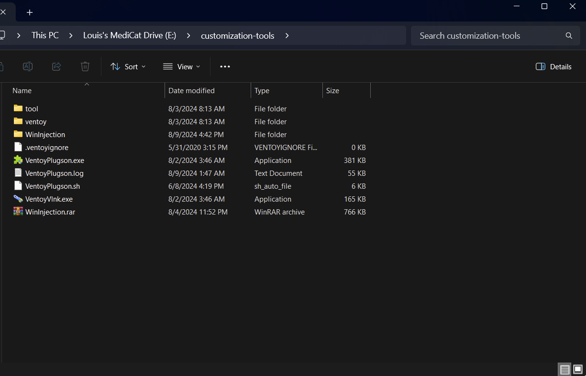
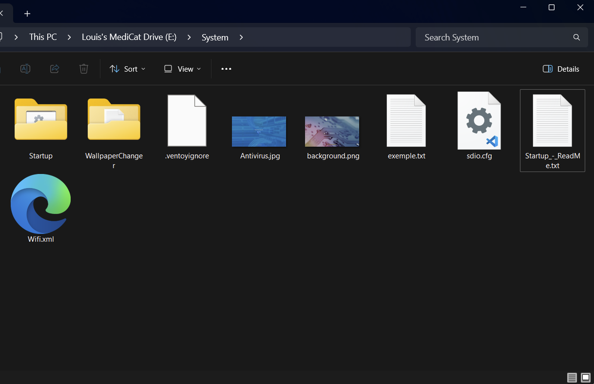
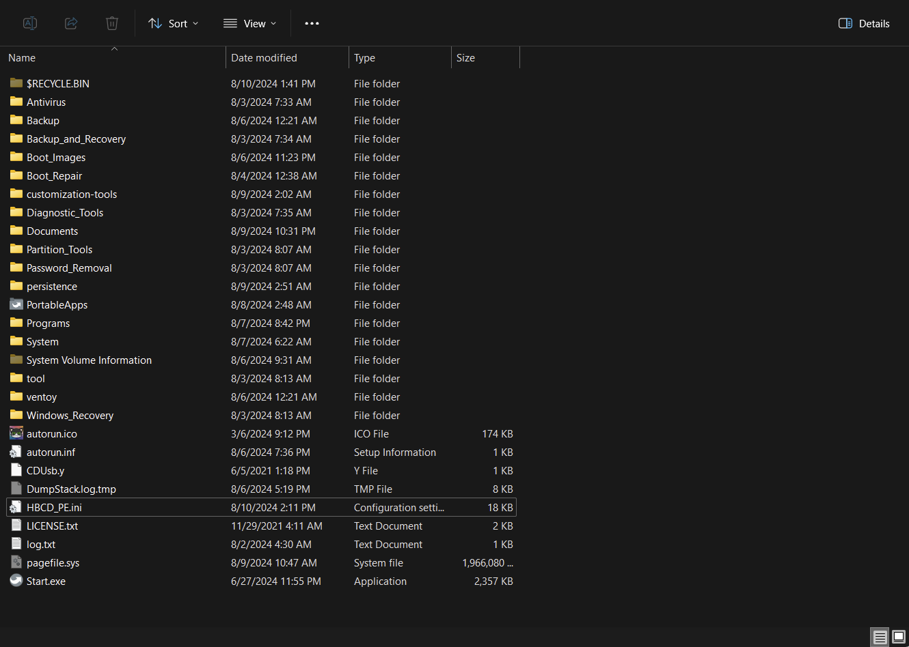

# Introduction

Medicat USB is based on Ventoy and includes lots of different apps and programs but they can be daunting to look at for the first time. In this guide ill be showing you how to customize Medicat to your own liking. I use a M.2 drive in a USB-C enclosure and recommend at least a 256GB. A thumb drive works too but they may be slower.

The drive should have MBR and NTFS

When you first install Medicat, you will have 2 partitions on your drive:

- VTOYEFI
- Medicat

VTOYEFI should most likely never be touched. While the Medicat partition is the one we will be working on.

# Updating

## PortableApps Launcher

Medicat also includes a Portableapps.com Launcher with some apps preinstalled:

First thing we want to do is to update the launcher and the apps inside it.

We can just double click the Start.exe to bring up the launcher.

Then Apps>Check for updates

If there are issues or you cannot access the internet. You can go directly on the Portablapps.com website and download from there. Then Apps>Install a New App [paf.exe]

Here is an excerpt from the official documentation:

> ### Manually Updating the Platform
>
> If you run into a situation where your copy of the PortableApps.com Platform is unable to automatically update itself due to corruption, disk issues, a network issue, or a bug, you can manually update it. First, head to the [Download page](https://portableapps.com/download) and download a copy of the current release. If your copy of the Platform is able to run, start it up and then click Apps and then Install a New App (.paf.exe). Explore to the location of the new copy of the Platform you downloaded, select it and click OK. The update should happen automatically and your PortableApps.com Platform will restart with the new version.
> If your copy of the PortableApps.com Platform does not start, explore to the location of the download of the current version you just downloaded. Run the installer and select Upgrade Existing Install. If you installed to one of the standard locations (root of a portable drive, userprofile folder, cloud folder) it should automatically detect it. If it does, select the platform to upgrade and continue. If it does not, select custom location and click Next. Now browse for the directory containing the platform's Start.exe launcher and select it. This folder will also contain the PortableApps folder that contains all your apps. Don't select the PortableApps folder within, though. Select to install and launch and everything should be working as before. If not, please post in our [platform support forum](https://portableapps.com/forums/support/portableapps_menu) with the complete details of your issue and we'll help you out.

## Snappy driver Installer

An app included in Medicat and that integrates very well with the included Mini Windows 10 image and that is useful overall is Snappy Driver Installer. It updates drivers through torrent. But the included torrent client is a hit or miss although it is better integrated in the app if it hits. Cloudflare Warp seems to hit more of the time, so check with WARP on if your internet is weird.

Here is the magnet link if you still wish to download it with your own torrent client. If you decide to go that route you will have to manually patch it in.

You'll find it in :\PortableApps\SnappyDriverInstaller\Drivers.

```
magnet:?xt=urn:btih:633b44c839bc3514a8f6ae832c434c788f20db8b&dn=SDIO_Update&tr=udp%3A%2F%2Ftracker.opentrackr.org%3A1337%2Fannounce&tr=udp%3A%2F%2Ftracker.tiny-vps.com%3A6969%2Fannounce&tr=udp%3A%2F%2Fopen.stealth.si%3A80%2Fannounce&tr=http%3A%2F%2Fshare.camoe.cn%3A8080%2Fannounce&tr=udp%3A%2F%2Ftracker.torrent.eu.org%3A451%2Fannounce
```

# Organization

To organize myself, I put all the Ventoy specific tools in a separate custom folder. These include:

- The Ventoy Plugson tool to modify Ventoy itself
- The Ventoy Shortcut tools
- The Windows Injection tool

I downloaded the .exe version of the Plugson tool and included it at the same place. As the Windows and Linux versions look in different folders for its libraries I need to create 2 folders "tool" & "ventoy".



# Windows Live Boot Environment

I use 2 Windows Live boot environments so I'm going to show you customization for both of them.

One thing to know is that they use pecmd to set up everything. It can be found at "X:\Windows\System32\" when booted in the environment.

## Mini Windows 10 (included in Medicat):

Here I needed to automatically install the OEM drivers at startup because my laptop touchpad doesn't work on boot.

I went into the /System folders of the drive. In there, the readme says to put the script in the Startup folder next to it.



### AutoDriver.bat

```batch
cd Y:\PortableApps\SnappyDriverInstaller

.\SDIO_x64_R767.exe -script:Y:\PortableApps\SnappyDriverInstaller\scripts\autodriver.txt

exit
```

The script calls for autodriver.txt so we'll go check that out.

```
#
# Snappy Driver Installer Origin
#
# Title: Simple Install
# Author: Glenn Delahoy
# Description: Simple script to install missing and better drivers.
# Notes: Test mode by default. Set 'enableinstall on' to make it live.
#

echo ==============================
echo Snappy Driver Installer Origin
echo Simple Install
echo ==============================
echo
echo Initialising...
verbose 384
logging off
enableinstall on
init
echo Installing missing and better drivers...
select missing better lan wlan-wifi touchpad chipset
install
end
```

This is a basic script copied from the default script.

I of course activated it and customized the drivers I wanted to install. For me it was just necessary to interact with the environment, touchpad and peripherals stuff in general.

Now when running Mini Windows 10 it will install OEM drivers for laptops so that we can interact with the environment without having to manually install the drivers every time with the keyboard.

## Hiren's Boot CD PE(separate download)

[Download](https://www.hirensbootcd.org/)

For HBCD I needed to automatically start the Start.exe from portableapps.

First I took the "HBCD_PE.ini" file from the root of the HBCD .iso and put it at the root of the drive.



I opened it up and modified the ExtPrograms subcommand to:

```ini
_SUB ExtPrograms
EXEC Y:\Start.exe
_END
```

Now when HBCD boots up it will start the PortableApps Launcher as well.
