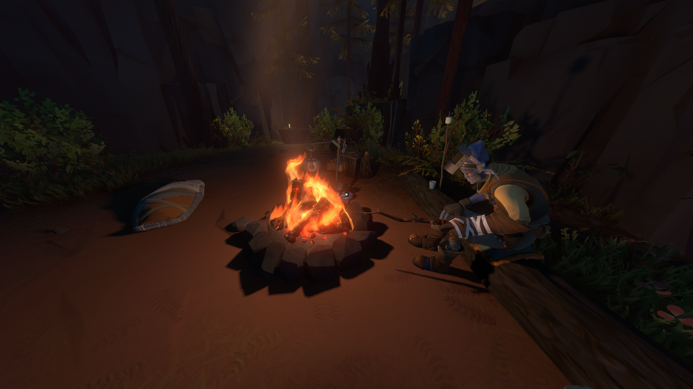

Nowadays, video games immerse us into brand new worlds. They can give us experiences that no other media can get close to. And with graphical technology improving year after year, the representation of these worlds are otherworldly. But the gameplay in these modern games follow more or less the same pattern. Spawn in, do a tutorial that doesn't let you do anything else if you don't finish it, obtain a quest from a NPC and have a waypoint appear on your head up display.

<em>Assassin's Creed Odyssey: quest markers and heads up display</em>

But the heads up display seems like it is too much these days. Cluttering your screen and handholding you every step of the way; preventing player exploration and discovery on their own.

I would like to introduce a game that changed the way I look at the video game media as a whole: Outer Wilds. This game has helped me sometimes in life. Outer Wilds breaks all of the conventions of video games: it has no quest marker, barely a heads up display and just drops us in this brand new world to let us explore it on our own. It does not insult the player's intelligence by hand holding him.

Booting up Outer Wilds for the first time, we hear the incredible soundtrack designed by Andrew Prahlow. You might have heard some of his work without knowing it. His music has been featured in many trailers, including Star Wars: The Force Awakens and The Martian. He also co-wrote music featured at Disney's Epcot and in Westworld the TV show. The vibe we get from the main menu's theme is some sort of melancholy, nostalgic feeling. Nostalgic of something we haven't even done yet. That's how powerful the soundtrack is on its own.

<em>Outer Wilds Main Menu</em>

In outer Wilds, we play as an alien, part of a species named the Hearthians living on Timber Hearth, this version of Earth. We wake with the crackling by the campfire, under the stars next to our friend. Our first instinct is to interact with him and see what he has to say. He talks about how you are the newest recruit in the Outer Wilds ventures program; a space odyssey program that this small species has achieved; and that today is your first launch. He tells us that we need to obtain the launch codes from someone in the observatory on the other side of the village. This game design is quite smart, as it forces the player to go through the whole village, discovering the culture, the other aliens that live in this small village and our place in all this.

So we do what he tells us and go through the village. It is a beautifully designed area with nice dialogues from the NPC's (Non-Player Characters). During this, we will encounter these 2 kids that want to play hide and seek, but can't because they won't be allowed to use the signalscope. They ask you if they could play hide and seek with your signalscope letting you be the seeker.

So we close our eyes counting and start seeking them. This part of the game teaches us about the signalscope and how to use it. The kids each have a radio and we need to locate them using the signalscope. Once we are done with the game of hide and seek we see that there is another frequency we can tap into: Outer Wilds Ventures. We see that there are a lot more places emitting sound. Each planet that is orbiting seems to emit some sort of sound. We learn through another NPC that each person in the Outer Wilds venture program has an instrument and plays it constantly. This realization broke me in this game. It is the equivalent of the Legend of Zelda's or Elden Ring's first time going out in the open world but the sound equivalent: anything you see in the distance, you can go there and explore.

Excited, we continue our way to the observatory. On our way we pass by the museum just under the observatory, we learn about an ancient civilisation that lived before us in this solar system but there is no trace of them in our present time. It seems that they went extinct from one second to another.

Our friend next to the statue tells us that we are the first astronauts in the Outer Wilds ventures program to be taking off with a Nomai translator. So we will be able to translate all the Nomai text around the solar system.

The Nomai translator was made possible by the Rosetta Stone in the museum. When we translate it we learn about some sort of device on the Attlerock (the moon to our Timber Hearth). The museum is full of introductions to game mechanics and real world mechanics ranging from the laws of gravity to a sun going supernova. There are more mechanics but I'm not delving too much into them to let you discover them if you find this game interesting. One particularly intriguing exhibit, though, in the museum is a special rock that mysteriously disappears when you don't look at it. This mesmerizing phenomenon, known as the "quantum rock," captivates players with its unique behavior. Its presence challenges your understanding of reality and beckons you to explore its properties, unlocking new pathways and insights into the game's intricate web of mysteries. It is a testament to the game's ability to surprise and engage players, leaving a lasting impression on those who encounter it.

On top of the museum there is a map of the solar system and our friend with the launch codes. He asks us what we are going to do once we are in space. This is very clever from the developers as it does not force a mission statement but lets you choose yourself what you're going to do in space.

Once we obtain the launch codes from our friend in the observatory, we are good to go back to the start in order to take off in our spaceship. But suddenly, as we are walking out of the museum...

The statue that we saw previously turn towards us and memories of our journey so far start appearing. We scramble to our friend and tell him what happens but he doesn't believe us.

Perplexed, we continue our way back to the launch platform, get in our spaceship and we are in space! Now where would we go first? The Attlerock? There was something about a device on the Attlerock, we might want to go check it out.

During our exploration we find out that this was a device the Nomai used to locate the eye of the universe; the symbol that was on the bottom right of Rosetta Stone in the museum. Continuing our exploration we meet another astronaut telling us more about what happens on the Attlerock and nudging us to go the the north pole to use our signalscope as it is the best place to view all the signals coming from the Outer Wilds Venture frequency.

This reinforced the Legend of Zelda feeling: we can go explore anything that we want where there is a signal coming from it. As we explore more of the Attlerock something major happens....

<em>The sun going supernova</em>

<em>Memories flashing as we spawn back at the start</em>

We die from the supernova and spawn back at the start a bit confused. As we are walking towards the elevator to go back up to our spaceship. Our friend stops us and tells us that we forgot to go get the launch codes. But we did: the launch codes are already in our possession. So how did he forget that?

At this point I'm not going further in the story. To let you guys experience it on your own. I hope I did the game justice to entice you enough to want to pick it up and experience for yourself.

The ending is phenomenal and it left a lasting impression on me. It is abstract but not too abstract so that each person can come to their own conclusions. We can read into it alot of different messages from dealing with grief to rebirthing/renewing to metaphors on life in general to therapeutic relentlessness or even the fact that is not about the destination but about the journey. We can even find... not a religious dimension but more spiritual by certain aspects?

The fact that in this game your character doesn't evolve is such a unique concept. There are no items that unlock new areas. No levels to level-up. The only thing evolving is our comprehension of the game and the puzzles therein. We are the ones evolving. I call this Knowledge Based Unlocks (KBUs) rather than Item Based/Level Based Unlocks.

Beware the allure of videos or spoilers that promise shortcuts or solutions. _Outer Wilds_ is a game that demands to be experienced firsthand, with its revelations and triumphs shaping your journey. Each discovery becomes a personal victory, etching itself into your memory and leaving an indelible mark on your soul. Embrace the challenge of translating the text, the mind-bending puzzles, and the captivating presence of the quantum rock, for it is through these experiences that the true depth and wonder of the Nomai's story are revealed.

<em>Outer Wilds- The Village where you wake up</em>

<em>Outer Wilds- Mystery</em>

<em>Outer Wilds-The solar system</em>

**Trailer of _Outer Wilds_**

Youtube Version:  
[https://www.youtube.com/watch?v=d6LGnVCL1_A](https://www.youtube.com/watch?v=d6LGnVCL1_A)

Steam Version:  
[https://store.steampowered.com/app/753640/Outer_Wilds/](https://store.steampowered.com/app/753640/Outer_Wilds/)
