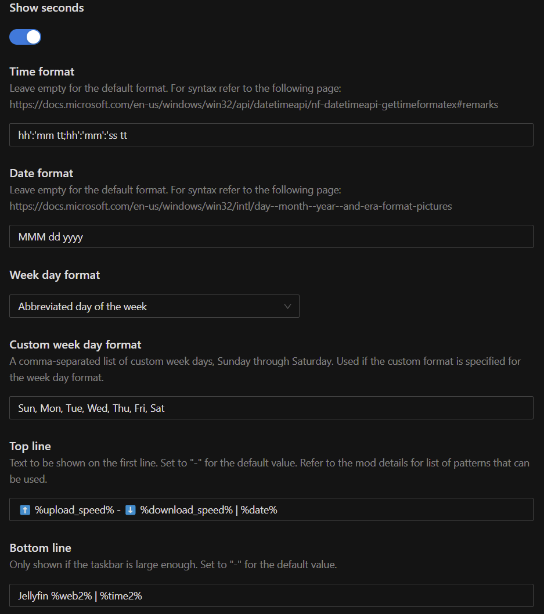
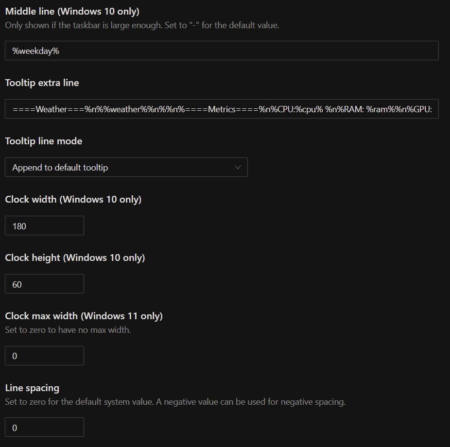
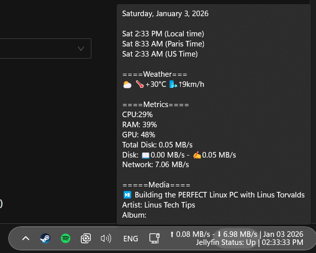

# My Whole Windows Setup

Medicat USB

PC windows installation:

- Driver Installs from medicat (Optional)

- Win Activation

- Win11Debloat

- CTT with O&O Shutup

  - UniGetUI with bundle

  - Install drivers from SNI (if not done yet)

  - Install driver for your GPU if you want

- Winaero Tweaker (Last touches)

- Powertoys if needed

# Customisation

## Windhawk

### Windows 11 Taskbar Styler

### Windows 11 Start Menu Styler

### Taskbar tray system icon tweaks

### Taskbar Dock Animation

### Taskbar auto-hide when maximized

### Taskbar auto-hide speed

### Modernize Folder Picker Dialog

### Explorerframe fixes for Win11 22H2+

### Better Taskbar Autohide

### Taskbar Clock Customization

#### Settings




##### Top line

```
⬆️ %upload_speed% - ⬇️ %download_speed% | %date%
```

##### Bottom line

```
Jellyfin %web2% | %time2%
```

##### Tooltip extra line

```
====Weather===%n%%weather%%n%%n%====Metrics====%n%CPU:%cpu% %n%RAM: %ram%%n%GPU: %gpu%%n%Total Disk: %disk_total%%n%Disk: 📖%disk_read% - ✍️%disk_write%%n%Network: %total_speed%%n%%n%=====Media====%n%%media_status% %media_title%%n%Artist: %media_artist%%n%Album: %media_album%
```

#### Result



Network Stack
